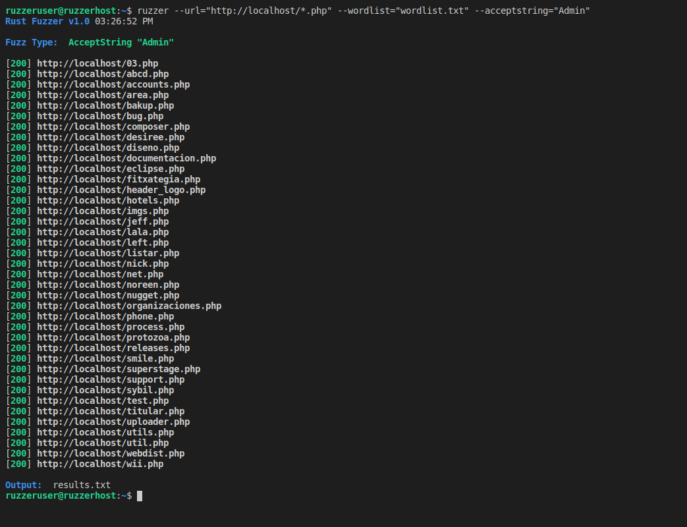
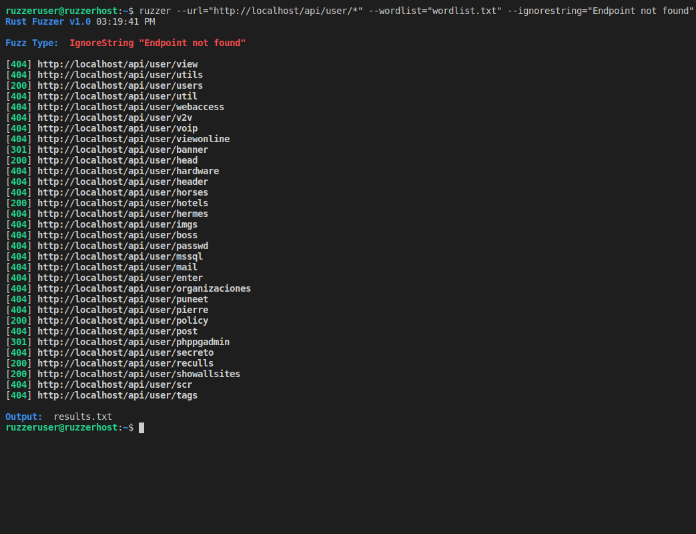
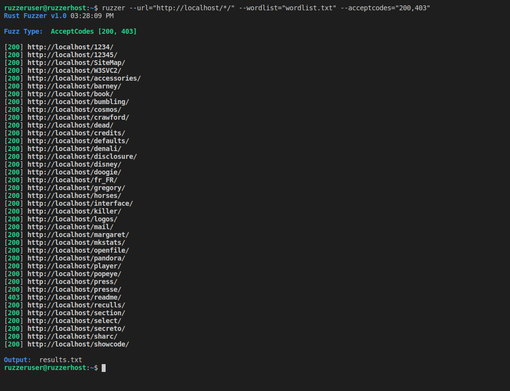
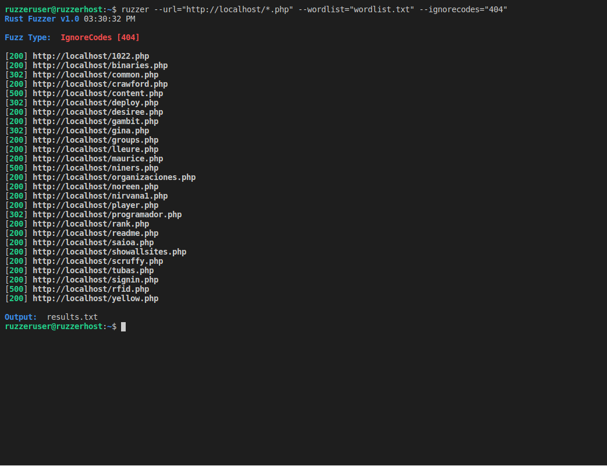
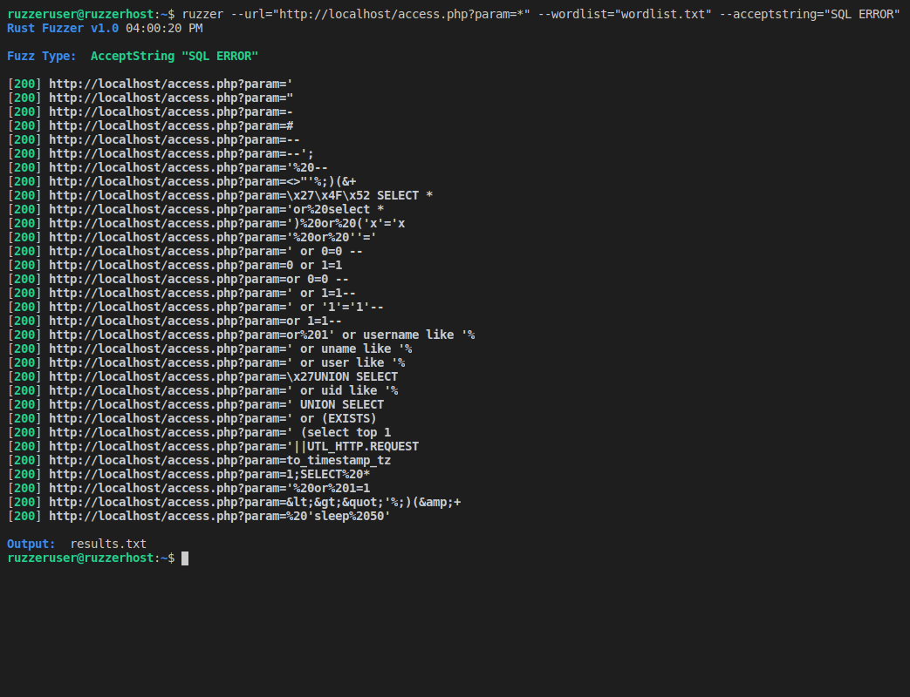
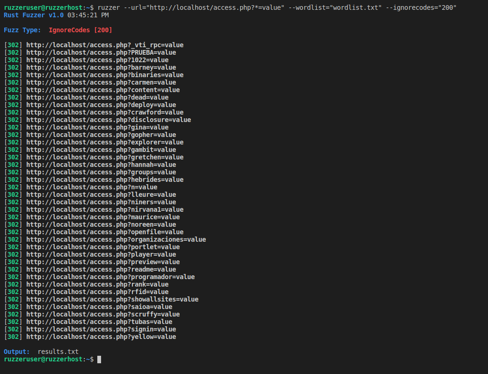

  

      
    
<b>Ruzzer is a multipurpose multi-threaded website fuzzer made with Rust</b>

    
<b>Fuzz for webpages, directories, specific http codes, strings in webpages, get params and more!</b>

  

   

  

    
  

   

  

    <h3>🌟 Features</h3>
    
🔹 Target a specific position within an URI using an asterisk (*)

    
🔹 Only output responses with or without specific HTTP codes

    
🔹 Only output responses from webpages with or without target strings in the content

    
🔹 Fast, Multi-Threaded Fuzzes

    
🔹 Output results to file
   
  

  
  
   

  

    
  

   
  
  

    <h3>🔍 Fuzz Arguments</h3>
<pre>
<b>-h     --help</b>            Show help
<b>-u     --url</b>             Url with an asterisk (*) marking the fuzz position
<b>-w     --wordlist</b>        Line seprated wordlist to fuzz target
<b>-ac    --acceptcodes</b>     HTTP codes to accept and forward to output
<b>-ic    --ignorecodes</b>     HTTP codes to ignore and not forward to output
<b>-as    --acceptstring</b>    Search content for string and forward Url if found
<b>-is    --ignorestring</b>    Search content for string and ignore Url if found
<b>-to    --timeout</b>         Timeout in seconds to wait for a request  [Default: 3, Range:1-180]
<b>-t     --threads</b>         Threads to use [Default: 5, Range:1-100]
<b>-o     --output</b>          Output results to a file
<b>-e     --extensions</b>      File Extensions (Requires fuzz position marker (*) at the end of the URL)
</pre>
  

   

  

    
  

   
  
  

    <h3>👉 Fuzz for Strings</h3>
    
<code><b>ruzzer --url=</b>"http://example.com/<b>*.ext</b>" <b>--wordlist=</b>"wordlist.txt" <b>--acceptstring=</b>"Admin"</code>

    
<code><b>ruzzer --url=</b>"http://example.com/api/user/<b>*</b>" <b>--wordlist=</b>"wordlist.txt" <b>--ignorestring=</b>"Endpoint not found"</code>

    

      
        
    

  

  
   

  

    
  

   
  
  

    <h3>👉 Fuzz for Directories & Files</h3>
    
<code><b>ruzzer --url=</b>"http://example.com/<b>*</b>" <b>--wordlist=</b>"wordlist.txt" <b>--acceptcodes=</b>"200,403"</code>

    
<code><b>ruzzer --url=</b>"http://example.com/<b>*</b>.ext" <b>--wordlist=</b>"wordlist.txt" <b>--ignorecodes=</b>"404"</code>

    

      
        
    

  

  
   

  

    
  

   
  
  

    <h3>👉 Fuzz Get Params & Values for Strings or HTTP Codes</h3>
    
<code><b>ruzzer --url=</b>"http://example.com/?param=<b>*</b>" <b>--wordlist=</b>"wordlist.txt" <b>--acceptstring=</b>"SQL ERROR"</code>

    
<code><b>ruzzer --url=</b>"http://example.com/?<b>*</b>=value" <b>--wordlist=</b>"wordlist.txt" <b>--ignorecodes=</b>"200"</code>

    

      
        
    

  

  
   

  

    
  

   
  
  

    <h3>⬇ Installation</h3>
    

      
<b>Download Pre-Built Latest Release</b>

      
🔹 wget https://github.com/akaBase/Ruzzer/raw/master/ruzzer

      
🔹 chmod +x ruzzer

      
🔹 Use Ruzzer!

    

    <h3>Or</h3>
    

      
<b>Build from Source</b>

      
🔹 Install Rust if it isn't already (Required to build to Ruzzer): https://www.rust-lang.org/tools/install

      
🔹 git clone https://github.com/akaBase/Ruzzer.git

      
🔹 cd Ruzzer/ruzzer-project

      
🔹 cargo build --release

      
🔹 build location: target/release/ruzzer

      
🔹 Use Ruzzer!

    

  

  
  
  
   

  

    
  

   
  
  

    <h3>👌 Disclaimer</h3>
    
<b>Ruzzer is provided as is and by using it you agree to take responsibility for your actions while using it.</b>

  

  

